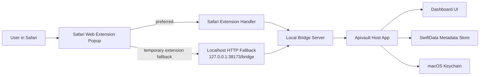
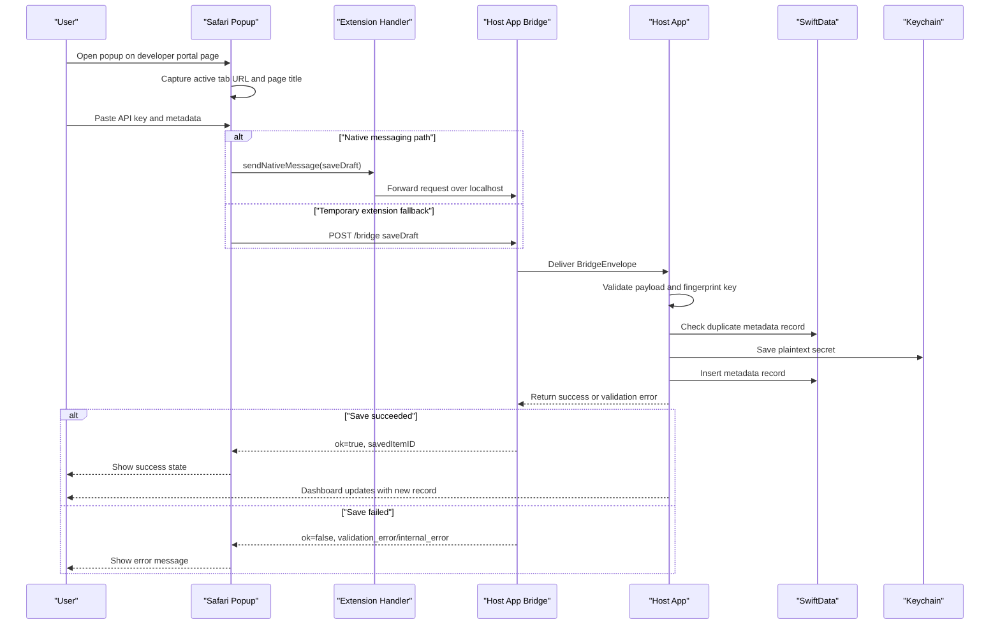

# Architecture

## Core Components

- `Host app`
  - native macOS app
  - owns secure storage and dashboard UI
  - runs a localhost bridge server while the app is open
- `Safari Web Extension`
  - detects supported sites
  - supports manual save from the popup on any page
  - sends save requests through Safari native messaging to the extension handler
- `Extension handler`
  - receives `browser.runtime.sendNativeMessage(...)` messages
  - forwards bridge requests to the running app over `127.0.0.1`
- `Vault`
  - secret values stored in macOS Keychain
  - metadata stored locally in SwiftData

## Architecture Diagram

## Data Flow

1. User visits a developer portal page and clicks the Safari extension.
2. Extension shows a manual save flow first.
3. User pastes or confirms the API key and related metadata in the extension UI.
4. Extension sends the capture request through the Safari extension handler.
5. Extension handler forwards the request to the running app over localhost.
6. Host app validates, encrypts, and stores the record.
7. Host app replies with success or validation failure.
8. Dashboard displays the saved key metadata and allows secure copy.

## Sequence Diagram

## Capture Strategy

- `phase 1`: manual save from the extension popup on any page
- `phase 2`: automatic recognition of supported developer portal pages
- `phase 3`: provider-specific extraction helpers for known API key screens

## Security Rules

- Do not treat this as a password manager.
- Do not scrape Google sign-in credentials.
- Minimize secret handling inside the extension.
- Require app unlock before revealing or copying sensitive values.

## Near-Term Milestones

1. Manual save from popup on any page.
2. Desktop CRUD for saved metadata and secure copy.
3. Session unlock for reveal and copy.
4. Assistive provider recognition for OpenAI, Anthropic, and Stripe.
5. Better failure handling and test fixtures.
